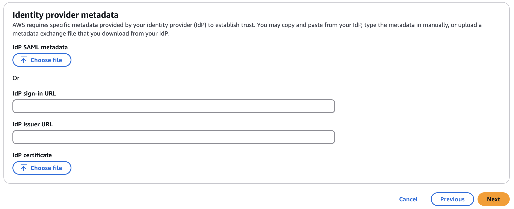

# AWS SSO with Auth0

We will create an [AWS IAM Identity Center (previously AWS SSO)](https://aws.amazon.com/fr/iam/identity-center/)
with [Auth0](https://auth0.com/) as an Identity Provider.
This AWS service can be only used and manage in the Management account of an [AWS Organization](https://aws.amazon.com/fr/organizations/).


In this repository, we will use an AWS SSO modules to create users in AWS but also on the Auth0 side.
In AWS, each Identity is a member of a group where a [permission set](https://docs.aws.amazon.com/singlesignon/latest/userguide/permissionsetsconcept.html) policy are defined.
Each [permission set](https://docs.aws.amazon.com/singlesignon/latest/userguide/permissionsetsconcept.html) let our Identity group to have permissions to **1 or many AWS accounts**.

## Prerequisite

Before using this repository, some manuals steps (who can not be automated) need to be done.

### Terraform providers

This repository use 2 providers: [AWS](https://registry.terraform.io/providers/hashicorp/aws/latest/docs) and [Auth0](https://registry.terraform.io/providers/auth0/auth0/latest/docs).

To use thoses providers, you need:
1. An AWS account with a user with full permissions on `identitystore`. You need to use the credential of
this user ([refer to the provider documentation](https://registry.terraform.io/providers/hashicorp/aws/latest/docs)).
2. An Auth0 tenant with an user with enough permission to manage users and app in your tenant. You need to generate a
token from this user ([refer to the provider documentation](https://registry.terraform.io/providers/auth0/auth0/latest/docs)).

### AWS ClickOps configuration

The AWS API do not exist to create the [AWS IAM Identity Center (previously AWS SSO)](https://aws.amazon.com/fr/iam/identity-center/). We need manually do the following actions: 
1. Go to your management account and select primary region
2. Go to AWS SSO and enable AWS SSO
3. Configure an [external identity provider source](https://docs.aws.amazon.com/singlesignon/latest/userguide/how-to-connect-idp.html)
4. Take the **AWS IAM Identity Center Assertion Consumer (ACS) Service URL** and put it to your `terraform.tfvars`
  for the variable `aws_acs_callback_url`.
5. Do not clause the AWS page when it is required to have the `Identity provider metadata`: 

Keep the page on the last step, we will finalize this step after the `terraform apply`.

## How to use it?

### Create group, users & policies

To set a group, you need to set the Terraform variable `sso_groups`.
An example of the variable (keep in mind, this is a list of group):
```hcl
sso_groups = [
  {
    name = "DevOps"
    description = "The DevOps team",
    policy_arns = [
      "arn:aws:iam::aws:policy/CloudWatchLogsFullAccess" # Policy must exist in the target account
    ],
    account_ids = [
      "123456789012", # AWS account ID
    ]
    members = [
      "contact@mehdilaruelle.com",
    ],
  },
]
```

In the previous example, we define:
- **name**: Who is the name of the group.
- **description**: A description of the group (always good to provide one).
- **account_ids**: The list of account IDs.
- **policy_arns**: A list of [AWS managed policies](https://docs.aws.amazon.com/singlesignon/latest/userguide/permissionsetcustom.html#permissionsetsampconcept). There is a limit of
  10 policies per group. You can 'bypass' this limit via an [inline policy](https://docs.aws.amazon.com/singlesignon/latest/userguide/permissionsetcustom.html#permissionsetsinlineconcept).
  **WARNING:** The AWS managed policies should exist to the target AWS account IDs or an error will raise. Prefer always to use the AWS managed policies who are present to all
  AWS Account instead of [Customer managed policies](https://docs.aws.amazon.com/singlesignon/latest/userguide/permissionsetcustom.html#permissionsetscmpconcept).
- **members**: A list of Identity. You should use the email address used by the user to login to authorize him, if you provide a bad email the user will NOT be able to login.


### Inline policies

If you reach the limit of 10 managed policy for a group OR you need to create a custom policy, you can create an [inline policy](https://docs.aws.amazon.com/singlesignon/latest/userguide/permissionsetcustom.html#permissionsetsinlineconcept) instead of [Customer managed policies](https://docs.aws.amazon.com/singlesignon/latest/userguide/permissionsetcustom.html#permissionsetscmpconcept).

An example of creating a policy and attach this policy for the `billing` groups:
```hcl
# Billing for prod account permission
data "aws_iam_policy_document" "billing" {
  statement {
    sid = "billing"

    actions = [
      "cur:*",
      "ce:*",
      "consolidatedbilling:*",
      "freetier:*",
      "tax:*",
      "account:GetAccountInformation"
    ]
    resources = ["*"]
  }
}

resource "aws_ssoadmin_permission_set_inline_policy" "billing" {
  instance_arn       = one(data.aws_ssoadmin_instances.idp.arns)
  permission_set_arn = module.main["billing"].permission_set_arn
  inline_policy      = data.aws_iam_policy_document.billing.json
}
```

## Final step of the configuration

When the `terraform apply` is done, you must finalize the configuration on the AWS side:
1. Go back to the AWS page for [external identity provider source](https://docs.aws.amazon.com/singlesignon/latest/userguide/how-to-connect-idp.html) in previous step.
2. Use the following command `terraform output -raw aws_sso_idp_metadata > /tmp/auth0_metadata.xml` to save the file in '/tmp/auth0_metadata.xml' and upload the file to the section page: `Identity provider metadata`: 
3. Go back to the main page of `AWS SSO` and get the `AWS access portal URL` on the right panel.

<!-- BEGIN_TF_DOCS -->
## Requirements

| Name | Version |
|------|---------|
| <a name="requirement_auth0"></a> [auth0](#requirement\_auth0) | ~> 1.0 |
| <a name="requirement_aws"></a> [aws](#requirement\_aws) | ~> 5.0 |
| <a name="requirement_http"></a> [http](#requirement\_http) | ~> 3.0 |

## Providers

| Name | Version |
|------|---------|
| <a name="provider_auth0"></a> [auth0](#provider\_auth0) | 1.15.0 |
| <a name="provider_aws"></a> [aws](#provider\_aws) | 5.94.1 |
| <a name="provider_http"></a> [http](#provider\_http) | 3.4.5 |

## Modules

| Name | Source | Version |
|------|--------|---------|
| <a name="module_main"></a> [main](#module\_main) | ./sso_groups | n/a |

## Resources

| Name | Type |
|------|------|
| [auth0_client.aws_sso](https://registry.terraform.io/providers/auth0/auth0/latest/docs/resources/client) | resource |
| [auth0_user.user](https://registry.terraform.io/providers/auth0/auth0/latest/docs/resources/user) | resource |
| [aws_identitystore_group_membership.idp](https://registry.terraform.io/providers/hashicorp/aws/latest/docs/resources/identitystore_group_membership) | resource |
| [aws_identitystore_user.idp](https://registry.terraform.io/providers/hashicorp/aws/latest/docs/resources/identitystore_user) | resource |
| [aws_ssoadmin_instances.idp](https://registry.terraform.io/providers/hashicorp/aws/latest/docs/data-sources/ssoadmin_instances) | data source |
| [http_http.idp_metadata](https://registry.terraform.io/providers/hashicorp/http/latest/docs/data-sources/http) | data source |

## Inputs

| Name | Description | Type | Default | Required |
|------|-------------|------|---------|:--------:|
| <a name="input_auth0_connection_name"></a> [auth0\_connection\_name](#input\_auth0\_connection\_name) | If this variable is used, it will create Auth0 users in the Connection name specify. | `string` | `null` | no |
| <a name="input_auth0_domain"></a> [auth0\_domain](#input\_auth0\_domain) | The Auth0 domain. | `string` | n/a | yes |
| <a name="input_aws_acs_callback_url"></a> [aws\_acs\_callback\_url](#input\_aws\_acs\_callback\_url) | The AWS IAM Identity Center Assertion Consumer (ACS) Service URL. It used as a callback by Auth0. | `string` | n/a | yes |
| <a name="input_region"></a> [region](#input\_region) | The region in which the resources will be created. | `string` | n/a | yes |
| <a name="input_sso_groups"></a> [sso\_groups](#input\_sso\_groups) | The list of group to create in AWS SSO including: members, policy ARN & account IDs. | <pre>list(object({<br/>    name        = string,<br/>    description = optional(string),<br/>    policy_arns = list(string),<br/>    members     = optional(list(string), []),<br/>    account_ids = optional(list(string), []),<br/>  }))</pre> | n/a | yes |
| <a name="input_tags"></a> [tags](#input\_tags) | A map of key/value to tags resources deploy by the stack. | `map(string)` | `{}` | no |

## Outputs

| Name | Description |
|------|-------------|
| <a name="output_arn"></a> [arn](#output\_arn) | n/a |
| <a name="output_aws_sso_idp_metadata"></a> [aws\_sso\_idp\_metadata](#output\_aws\_sso\_idp\_metadata) | n/a |
| <a name="output_groups"></a> [groups](#output\_groups) | n/a |
| <a name="output_identity_store_id"></a> [identity\_store\_id](#output\_identity\_store\_id) | n/a |
| <a name="output_users"></a> [users](#output\_users) | n/a |
<!-- END_TF_DOCS -->